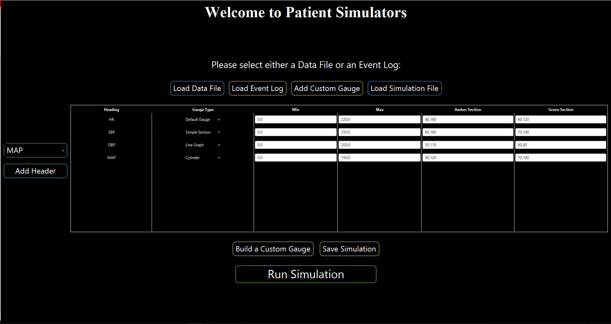
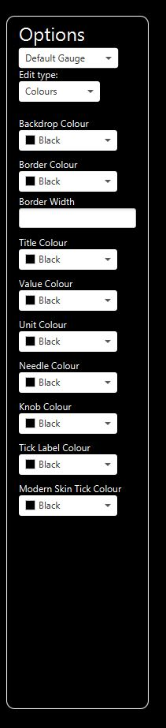
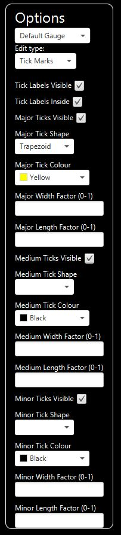
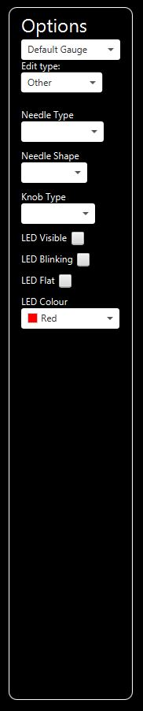

# PatientSimulators
Patient simulators is a dashboard that allows you to viualise certain measurements from CAE Healthcare simulator models. Its use is to aid in teaching Physiology students at the University of Bristol and was created at the request of Dr Richard Helyer. 

  It allows for the selection of multiple headers which are extracted from the simulation file and you can also load in an events log generated by the system.
  
  
  The setup for simulations and custom gauges are also serialisable, so can be saved and used later. 
  
  Custom gauges can also be created with a wide range of options, to allow the user to add their own touch to their simulations. 
   
     
   
   Or create monstrosities using questionable colour and styling choices
   
   
